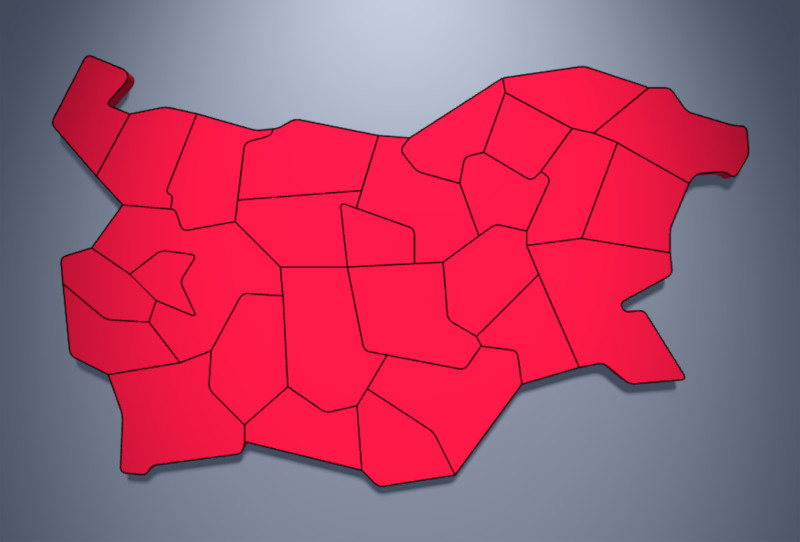
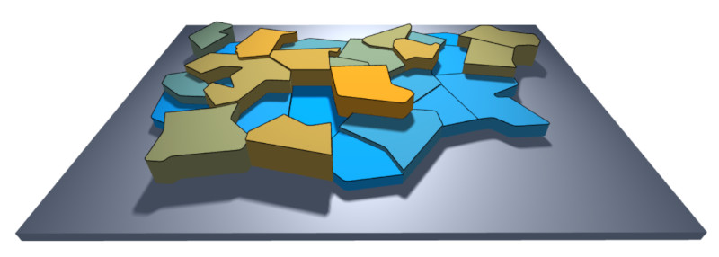

# bgmap
Low-poly map of provinces in Bulgaria.

The file `maps.js` defines
the class `Map` that returns a province or the whole country either
as a 3D mesh (i.e. `THREE.BufferGeometry` for `THREE.Mesh`) or
a 2D contour (also `THREE.BufferGeometry` but `for THREE.Line`).

It is possible to apply rounding of borders.

The shapes of provinces are manually crafted in diagrams.net, exported
to XML and imported to `maps.js`.

## Examples

The following examples show code sniplets. Click on the image 
to run the example in real-rime in your browser. Use your
default pointing device to change the viewpoint.


### 1. Outline of Bulgaria

The example extracts the outline of Bulgaria with
`mapGeometry2D` and region name set to `'BG'`.

```javascript
geometry = map.mapGeometry2D( 'BG' );
material = new THREE.LineBasicMaterial(...);

region = new THREE.Line( geometry, material );
```

[](https://boytchev.github.io/bgmap/examples/example-1.html)


### 2. Outlines of Bulgarian provinces

The example uses the list of all regions from `regions`
and extract the outline of all regions, that are not
called `'BG'`.

```javascript
for( regionName in map.regions ) if( regionName != 'BG' )
{
  geometry = map.mapGeometry2D( regionName );
  material = new THREE.LineBasicMaterial(...);
	
  region = new THREE.Line( geometry, material );
  :	
}
```

[](https://boytchev.github.io/bgmap/examples/example-2.html)


### 3. Bulgaria with provinces

The 3D image of Bulgaria is generated by `mapGeometry2D`,
the outlines of the provinces are like in the previous example.

```javascript
// Bulgaria in 3D
geometry = map.mapGeometry3D( 'BG' );
material = new THREE.MeshStandardMaterial(...);

region = new THREE.Line( geometry, material );

// outlines of provinces in Bulgaria
for( regionName in map.regions ) if( regionName != 'BG' )
{
  geometry = map.mapGeometry2D( regionName );
  material = new THREE.LineBasicMaterial(...);
	
  region = new THREE.Line( geometry, material );
  :	
}
```

[](https://boytchev.github.io/bgmap/examples/example-3.html)


### 4. Provinces in random colors

The material of each province can be set to a different
color. Regions are extracted by `mapGeometry3D`.

[](https://boytchev.github.io/bgmap/examples/example-4.html)


### 5. Elevated provinces

The constructed 3D object can be manipulated as any THREE.Object3D. The initial height of provinces is 1
and this can be changed by the scaling in `scale.y`.

[](https://boytchev.github.io/bgmap/examples/example-5.html)


September, 2021


