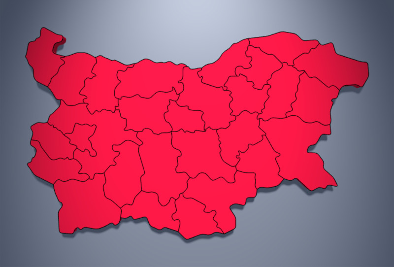
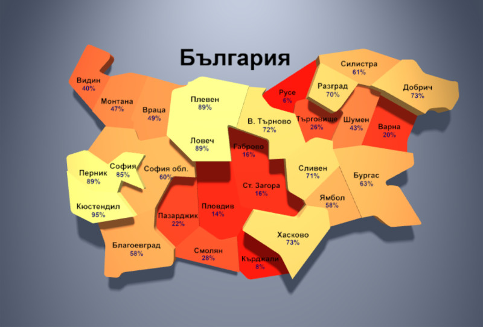
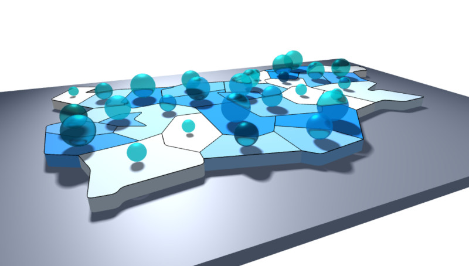
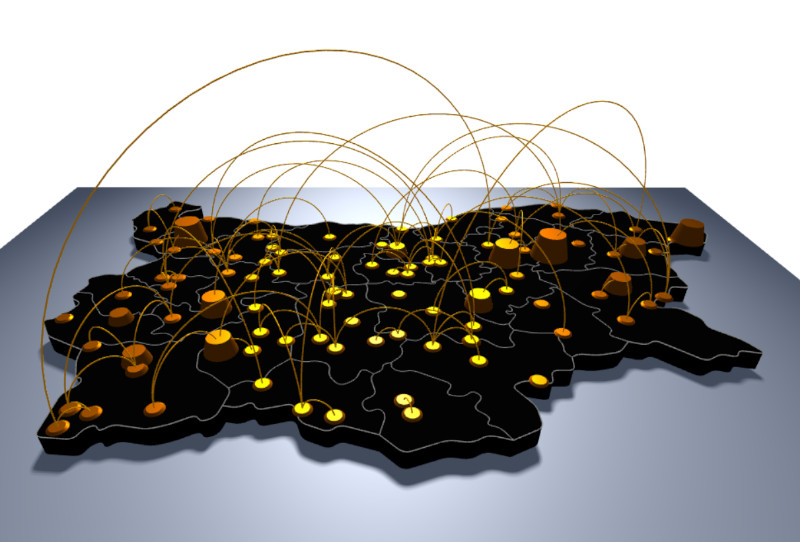
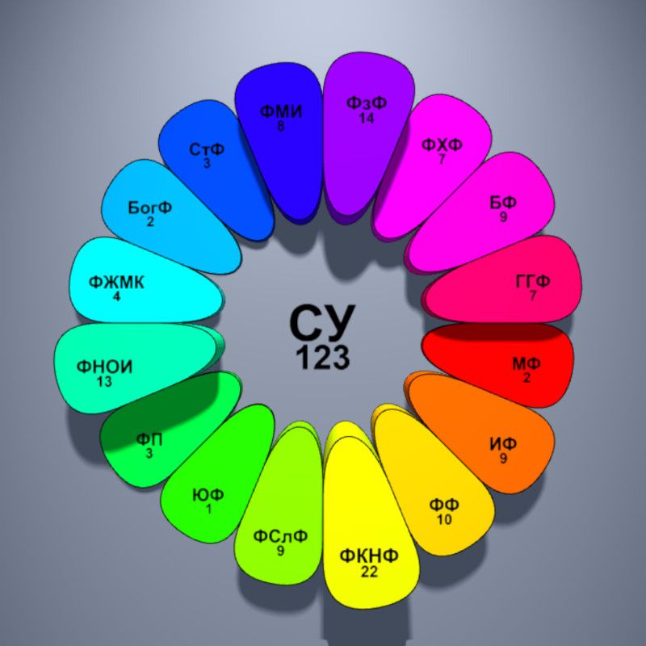

# map.js

A minimalistic library for generating outlines
and flat 3D shapes of maps and map regions. The library is
implemented as a single `map.js` file.

### Table of contents

* [**Quick reference**](#quick-reference): [examples](preview-of-examples) and [API](preview-of-the-api)
* [**API**](#api): [constructor](#constructor), [names](#region-names), [shapes](#region-shapes), [labels](#region-label) and [centers](#region-center)
* [**Data**](#map-data): [XML](#xml-data) and [object](#object-data)
* [**Examples**](#examples)
  * Simple: [country](#outline-of-country), [provinces](#outlines-of-provinces) and [3D map](#3d-map)
  * Intermediate: [colors](#colored-provinces), [elevation](#elevated-provinces) and [labels](#labels-of-provinces)
  * Advanced: [water supply](#water-supply), [overlays](#overlaying-maps) and [procedural maps](#procedural-maps)


## Quick reference
### Preview of examples

Click on an image to run the example online.

[](https://boytchev.github.io/map/examples/example-1.html)
[](https://boytchev.github.io/map/examples/example-2.html)
[](https://boytchev.github.io/map/examples/example-3-ex.html)
[](https://boytchev.github.io/map/examples/example-4.html)
[](https://boytchev.github.io/map/examples/example-5.html)
[](https://boytchev.github.io/map/examples/example-7.html)
[](https://boytchev.github.io/map/examples/example-6.html)
[](https://boytchev.github.io/map/examples/example-8.html)
[](https://boytchev.github.io/map/examples/example-9.html)


### Preview of the API

```javascript
new Map( xmlFilename, callback, options ) // Map
new Map( object, callback, options ) // Map

map.regions // [string, string, ...]

map.region2D( regionName, height, color ) // THREE.Line
map.region3D( regionName, height, color ) // THREE.Mesh

map.geometry2D( regionName ) // THREE.BufferGeometry
map.geometry3D( regionName ) // THREE.BufferGeometry

map.label2D( regionName, label, height, color, scale, offset ) // THREE.Mesh

map.center( regionName, height ) // THREE.Vector3
```


## API

The library `map.js` defines the class `Map` that encapsulates all the functions.
You need to create an instance of `Map` in order to use it.

### Constructor

A map instance is created either on map date from external XML file, or on a custom created map.

```javascript
new Map( xmlFilename, callback, options )
new Map( object, callback, options )
```

* `xmlFilename` is a name of an XML file defining the map and its regions.
The library provides a low-poly map of Bulgaria in `map.xml` and a more
detailed map in `map-ex.xml`.

* `object` is a Javascript object defining the map and its regions. It could
be used to provide procedural maps.

* `callback` is an optional name of a user-defined callback function, that
receives the map instance as parameter, when the instance is ready. This is
useful for XML maps, that are loaded asynchronously.

* `options` is an optional set of configuration parameters. Its default structure is `{width: 45, height: 28, roundness: 25}`, where `width` and
`height` define the size of the map, and `roundness` sets the rounding
radius of some vertices in the map.

There are three typical patterns for making instances of `Map`.
The first one uses a callback function to process the map, once
it is ready:

```javascript
new Map( 'map.xml', drawMap );

function drawMap( map )
{
  // map is ready to be used
}
```

The second pattern uses the `=>` syntax:

```javascript
new Map( 'map.xml', map => {/*map is ready to be used*/} );
```

The third pattern is applicable only to procedural maps, when
the map data is not load asynchronously from external file.
In such case the map instance can be immediately used.

```javascript
var map = new Map( proceduralMap );

// map is ready to be used 
```

### Region names

```javascript
map.regions
```

This property contain an array of the names of all regions. 
It can be used to traverse through all regions in the map:

```javascript
for( regionName in map.regions )
{
  // regionName contains the name of a region
}
```

The provided maps `map.xml` and `map-ex.xml` define the shapes of Buigaria
and its provinces. These shapes are all treated as regions. To traverse
only the provinces the code can filter out the country by its region name:

```javascript
for( regionName in map.regions )
  if( regionName != 'BG' )
  {
    // regionName contains only the name of a province
  }
```

### Region shapes

```javascript
map.region2D( regionName, height, color ) // THREE.Line
map.region3D( regionName, height, color ) // THREE.Mesh
```

These methods generate a 2D shape (outline) or a 3D shape (flat bar)
of the region called `regionName`. Optional parameters `height`
and `color` define the heigh and the color of the shape.
By default `height` is 1 and `color` is `'black'` for 2D shapes
and `'white'` for 3D shapes.

The raw geometry of a region is generated by these two methods:

```javascript
map.geometry2D( regionName ) // THREE.BufferGeometry
map.geometry2D( regionName ) // THREE.BufferGeometry
```

### Region label

```javascript
map.label2D( regionName, labelText, height, color, scale, offset ) // THREE.Mesh
```

The method `label2D` generates a 2D rectangular shape
containing a given `labelText`. The shape is positioned
at the center of region called `regionName`. The vertical
location of the label is set by `height`, its colour is `color` 
and scale is a number `scale`. The last parameter `offset` is
a number used to shift the label as of it is on another line
in a multiline text. By default, `height=1`, `color='black'`,
`scale=1` and `offset=0`.


### Region center

```javascript
map.center( regionName, height ) // THREE.Vector3
```

This method returns the virtual center of a region. It is used
internally by `map.label2D` to position labels and 
by the user program to place other objects over regions.


## Map data

The library builds 2D and 3D shapes of regions based on map data.
There are two ways to provide these data: as XML file and as
Javascript object.

### XML Data

#### Regions

The XML files included in the libabry are exported from file
`map.drawio` which can be be edited in [Diagrams.net](https://www.diagrams.net/) (previously known as Draw.io).
The `Map` class has minimal parser of XML files, i.e. its
looks only for specific nodes, ignoring all the rest. The
structure of the XMl file must be like this:

```xml
<?xml version="1.0" encoding="UTF-8"?>
<mxfile ...>
  :
  <mxCell value="BG" ...>
    <mxGeometry x="0.635" y="149" width="50" height="50" relative="1" as="geometry">
      <mxPoint x="370" y="-620" as="sourcePoint" />
      <Array as="points">
          <mxPoint x="540" y="-550" />
          <mxPoint x="540" y="-510" />
		  :
          <mxPoint x="220" y="-330" />
      </Array>
      <mxPoint x="1" as="offset" />
	</mxGeometry>
  </mxCell>

  <mxCell value="region-name" ...>
    :
  </mxCell>
  :
</mxfile>
```

Each region is defined as `<mxCell>` with the name of the
region in attribute `value`. The geographical shape of the
region is defined by a starting point `<mxPoint ... as="sourcePoint">`
and a list of next consequitive points `<mxPoint>` from `<Array>`.

In the example above the first region is called `BG` and
its shapes is defined by points `(370,-620), (540,-550), (540,-510), ... (220,330)`.

The position of the label (this is the virtual center) is
calculated from the data in `<mxGeometry ...>` and
`<mxPoint ... as="offset">`.


#### Locations

The map in file `examples\example-8.xml` contains locations of cities.
Such locations are not encoded as shapes of points. The XML parser
extract the coordinates and generates a small circle as a shape.

```xml
  :
  <mxCell value="region-name" ...>
    <mxGeometry x="1330" y="322" as="geometry" .../>
  </mxCell>
  :
</mxfile>
```


### Object Data

When the map data is provided as a Javascript object it must have
the following structure:

```jxml
{
  name: {shape:[x1, y1, x2, y2, ...], label: [x,y]},
  name: {shape:[x1, y1, x2, y2, ...], label: [x,y]},
  :
}
```
where `name` is the name of a region, `shape` is an array of
3 or more pairs of 2D coordinates (x1,y1), (x2,y2), ... defining
the outline of the region, and `label` is an array of one pair of
2D coordinates (x,y) of the location of the region label.


## Examples

The following examples show code sniplets. Click on the image 
to run the example in real-rime in your browser. Use your
default pointing device to change the viewpoint.

### Simple examples

These examples show the basic functionality of `maps.js` &ndash;
using 2D and 3D shapes of regions.

#### Outline of country

This example draws the outline of Bulgaria as a 2D shape.

```javascript
new Map( '../map.xml', drawMap );

function drawMap( map )
{
  scene.add( map.region2D( 'BG' ) );
}
```

[](https://boytchev.github.io/map/examples/example-1.html)


The following two versions of the example show the role of the
`roundness` parameter in the map options.

Sharp outline with `roundness=0`:

```javascript
new Map( '../map.xml', drawMap, {roundness: 0} );
```
[](https://boytchev.github.io/map/examples/example-1-sharp.html)

Smooth outline with `roundness=100`:

```javascript
new Map( '../map.xml', drawMap, {roundness: 100} );
```
[](https://boytchev.github.io/map/examples/example-1-smooth.html)


#### Outlines of provinces

This example draws the outlines of Bulgarian provinces. The outline
of the contry is excluded.

```javascript
new Map( '../map.xml', drawMap );

function drawMap( map )
{
  for( var regionName in map.regions )
    if( regionName != 'BG' )
      scene.add( map.region2D( regionName ) );
}
```

[](https://boytchev.github.io/map/examples/example-2.html)


#### 3D map

```javascript
new Map( '../map.xml', drawMap );

function drawMap( map )
{
  // draw Bulgaria as 3D plate
  scene.add( map.region3D( 'BG', 1, 'crimson' ) );

  // draw provinces outlines
  for( var regionName in map.regions )
    if( regionName!='BG' )
      scene.add( map.region2D( regionName ) );
}
```

[](https://boytchev.github.io/map/examples/example-3.html)

The same example using the extended map `map-ex.xml` instead of  `map.xml`:

[](https://boytchev.github.io/map/examples/example-3-ex.html)


### Intermediate examples

These examples show modification of regions &ndash; different colors,
heights and labels.

#### Colored provinces

This example paints every province in a random color.

```javascript
new Map( '../map.xml', drawMap );

function drawMap( map )
{
  for( var regionName in map.regions )
    if( regionName!='BG' )
    {
      var color = new THREE.Color( 0xFFFFFF*Math.random() );

      scene.add( map.region3D( regionName, 1, color ) );
      scene.add( map.region2D( regionName, 1 ) );
    }
}
```

[](https://boytchev.github.io/map/examples/example-4.html)


#### Elevated provinces

This example generates random value for a province and then
uses this value to determin the height (elevation) and the color.

```javascript
new Map( '../map.xml', drawMap );

function drawMap( map )
{
  for( var regionName in map.regions )
    if( regionName!='BG' )
    {
      var value = Math.random();
      var color = new THREE.Color( value, 0.6, 1-value );
      var height = 1+3*value;

      scene.add( map.region3D( regionName, height, color ) );
      scene.add( map.region2D( regionName, height ) );
   }
}
```

[](https://boytchev.github.io/map/examples/example-5.html)


#### Labels of provinces

This example shows how labels are done. Because provinces' names
are encoded in the map as `BG`, `BL`, `BU` and so on, there is
an array of the full names of the provinces.

```javascript
new Map( '../map.xml', drawMap );

var fullNames = {BG: 'България', BL: 'Благоевград', ... YA: 'Ямбол' };

function drawMap( map )
{
  :
  for( var regionName in map.regions ) if( regionName!='BG' )
  {
    :
    scene.add(
      // province name
      map.label2D( regionName, fullNames[regionName], value, 'black', 0.8 ),
      // province percentage
      map.label2D( regionName, Math.round(100*value/3.1)+'%', value, 'navy', 0.7, 1.2 )
    );
  }
}

```

[](https://boytchev.github.io/map/examples/example-7.html)


### Advanced examples

These examples shows advanced usage of `map.js` by combining
different objects and composing more complex maps.

#### Water supply

Imaginary map of water supply per province.

```javascript
new Map( '../map.xml', drawMap );

function drawMap( map )
{
  for( var regionName in map.regions )
    if( regionName!='BG' )
    {
	  :
      scene.add( map.region3D( regionName, 1, color ) );
      scene.add( map.region2D( regionName, 1 ) );

      var water = new THREE.Mesh(
         new THREE.IcosahedronGeometry( radius, 4 ),
         new THREE.MeshPhysicalMaterial( {...} )
      );

      water.position.copy( map.center( regionName, 1+radius ) );
      water.castShadow = true;

      scene.add( water );
   }
}
```

[](https://boytchev.github.io/map/examples/example-6.html)

#### Overlaying maps

Map `map-ex.xml` provides outlines of provinces, map `example-8.xml`
provides locations of towns. To have both maps with equal sizes and
positions, they have the same region for the whole country. As the
maps are loaded asynchronously, they are chained:

```javascript
new Map( '../map-ex.xml', loadCityMap );
		
function loadCityMap( map )
{
  countryMap = map;
  new Map( 'example-8.xml', drawMap );
}

function drawMap( cityMap )
{
  // using countryMap for provinces and cityMap for cities
  :
}
```

[](https://boytchev.github.io/map/examples/example-8.html)


#### Procedural maps

Example of number of undergraduate programs in the 16 faculties of
Sofia University. The map of the faculties is generated procedurally.
The example also rotates the labels according to the viewer position.

```javascript
// generate a procedural map
var proceduralMap = {};
{
  // functions to calculate coordinates
  function x( ... ) { ... }
  function y( ... ) { ... }

  // the university as shapeless object	
  proceduralMap[names[0]] = {shape: [], label: [0,0]};
		
  // the faculties 
  for( var i=1; i<names.length; i++ )
    proceduralMap[names[i]] = {
      shape: [x(...), y(...), x(...), y(...), ...],
      label: [x(...), y(..) ]
    };
}

// map of faculties
var map = new Map( proceduralMap, null, {roundness:5} );
:
```

[](https://boytchev.github.io/map/examples/example-9.html)


October, 2021
