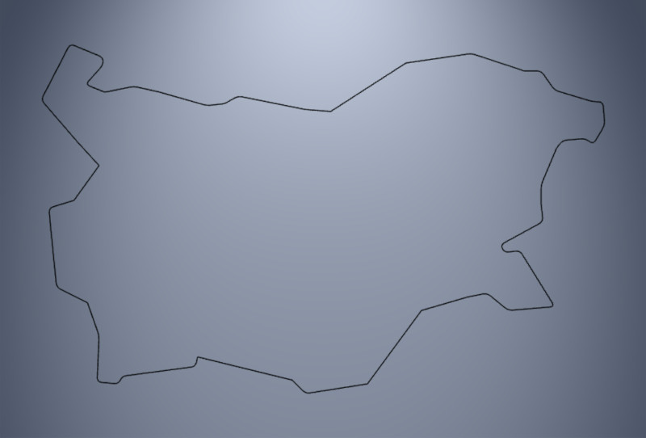

# bgmap
Low-poly map of provinces in Bulgaria. The file `maps.js` defines
the class `Map` that returns a province or the whole country either
as a 3D mesh (i.e. `THREE.BufferGeometry` for `THREE.Mesh`) or
a 2D contour (also `THREE.BufferGeometry` but `for THREE.Line`).

It is possible to apply rounding of borders.

The shapes of provinces are manually crafted in diagrams.net, exported
to XML and imported to `maps.js`.

## Examples

The following examples show code sniplets. Click on the image 
to run the example in real-rime in your browser. Use the mouse
or finger (for touch screens) to control the viewpoint.


### 1. Outline of Bulgaria

The geometry for the outline of Bulgaria is retrieved by
the method `mapGeometry2D` with parameter `'BG'`.

```javascript
geometry = map.mapGeometry2D( 'BG' );
material = new THREE.LineBasicMaterial(...);

region = new THREE.Line( geometry, material );
```

[](https://boytchev.github.io/bgmap/example-1.html)


### 2. Outlines of Bulgarian provinces

The geometries for the outlines of provinces in Bulgaria are
retrieved one by one by the method `mapGeometry2D` with
province's name as parameter. The list of regions in the map
(all provinces and the country itself) is stored in `regions`.

```javascript
for( name in map.regions ) if( name!='BG' )
{
  geometry = map.mapGeometry2D( name );
  material = new THREE.LineBasicMaterial(...);
	
  region = new THREE.Line( geometry, material );
  :	
}
```

[](https://boytchev.github.io/bgmap/example-2.html)


September, 2021


