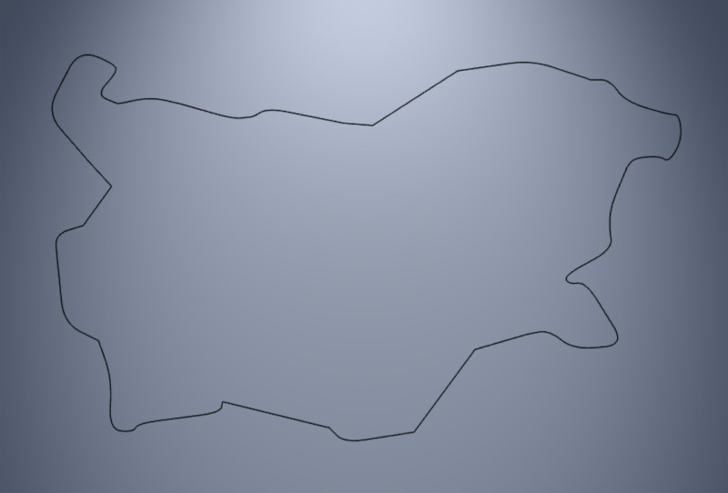
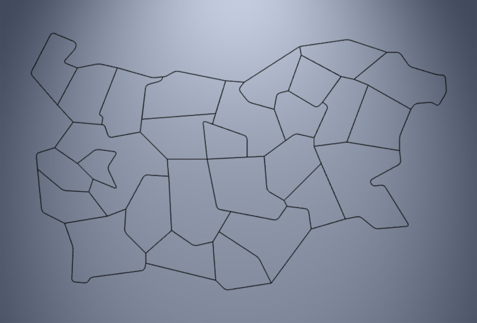
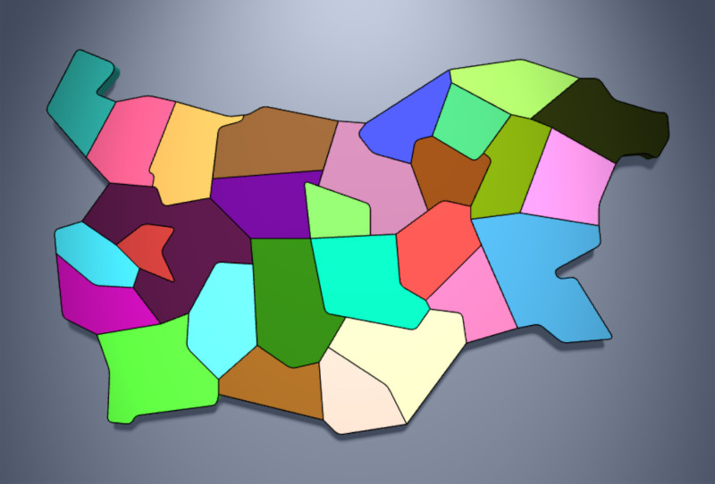

# bgmap
Low-poly map of provinces in Bulgaria.

`maps.js` is a minimialistic library for generating
outlines or 3D shapes of Bulgaria and its provinces.
It can be used for demonstrating geographical
interactive images.

## Using

The library is implemented as a single `maps.js` file.
It is initialized by generating an instance of the class `Map`.

```javascript
new Map( xmlFilename, drawMap, options );
```

* `xmlFilename` is a name of an XML file defining the
regions in Bulgaria. The library provides low-poly definitions
of regions in Bulgaria in file `bgmap-level-0.xml`)

* `drawMap` is a user-defined callback function, that receives the map instance as parameter. This instance is used to extract
outlines and 3D shapes of regions. Because the XML processing is
asynchronous, the instance can be used only after the callback
function is actually called.

* `options` is an optional parameter for the map generator with
structure `{width: ..., height: ..., roundness: ...}`. The `width` and `height` attributes define the size of the map. If these values are not provided, `Map` uses global variables `MAP_WIDTH` and `MAP_HEIGHT`. If they are not defined, `Map` assumes the width is 45 and the height is 28. The attribute `roundness` sets the rounding radius of some vertices in the map. The default value is 25. The following two illustration show sharp outline (roundness=0) and smooth outline (roundness=100):

[](https://boytchev.github.io/bgmap/examples/example-1-sharp.html) [](https://boytchev.github.io/bgmap/examples/example-1-smooth.html)


## API

The call-back function has one parameter &ndash; an instance
of the map. It has:

* `regions` &ndash; an array of the names of all regions
* `mapGeometry2D( regionName )` &ndash; a method that generates the outline of a region as `THREE.BufferGeometry` for `THREE.Line`
* `mapGeometry3D( regionName )` &ndash; a method that generates the 3D shape of a region as `THREE.BufferGeometry` for `THREE.Mesh`

That's all.


## Data


## Examples

The following examples show code sniplets. Click on the image 
to run the example in real-rime in your browser. Use your
default pointing device to change the viewpoint.


### 1. Outline of Bulgaria

The example extracts the outline of Bulgaria with
`mapGeometry2D` and region name set to `'BG'`.

```javascript
// get the geometry of the outline
geometry = map.mapGeometry2D( 'BG' );

// set any custom material for lines
material = new THREE.LineBasicMaterial(...);

// construct line as 3D object
region = new THREE.Line( geometry, material );
```

[](https://boytchev.github.io/bgmap/examples/example-1.html)


### 2. Outlines of Bulgarian provinces

The example uses the list of all regions from `regions`
and extract the outline of all regions, that are not
called `'BG'`.

```javascript
for( regionName in map.regions ) if( regionName != 'BG' )
{
  geometry = map.mapGeometry2D( regionName );
  material = new THREE.LineBasicMaterial(...);
	
  region = new THREE.Line( geometry, material );
  :	
}
```

[](https://boytchev.github.io/bgmap/examples/example-2.html)


### 3. Bulgaria with provinces

The 3D image of Bulgaria is generated by `mapGeometry2D`,
the outlines of the provinces are like in the previous example.

```javascript
// Bulgaria in 3D
geometry = map.mapGeometry3D( 'BG' );
material = new THREE.MeshStandardMaterial(...);

region = new THREE.Line( geometry, material );

// outlines of provinces in Bulgaria
for( regionName in map.regions ) if( regionName != 'BG' )
{
  geometry = map.mapGeometry2D( regionName );
  material = new THREE.LineBasicMaterial(...);
	
  region = new THREE.Line( geometry, material );
  :	
}
```

[](https://boytchev.github.io/bgmap/examples/example-3.html)


### 4. Provinces in random colors

The material of each province can be set to a different
color. Regions are extracted by `mapGeometry3D`.

[](https://boytchev.github.io/bgmap/examples/example-4.html)


### 5. Elevated provinces

The constructed 3D object can be manipulated as any THREE.Object3D. The initial height of provinces is 1
and this can be changed by the scaling in `scale.y`.

[](https://boytchev.github.io/bgmap/examples/example-5.html)


September, 2021


